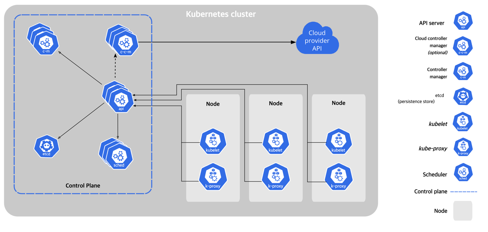

# Cloud Controller Manager

- Design
- Cloud controller manager funcitons
- Authorization

k8s를 public, private, hybrid cloud에서 운영 가능  
cloud-controller-manager는 k8s control plane component로서 cloud 특화된 control logic을 포함, cluster를 cloud provier API에 연결하게
하고, cloud platform과의 통신을 해당 컨트롤러에게 위임 (분리)
plugin 메커니즘을 사용하여 서로 다른 cloud provider를 지원

---

## Design

- cloud controller manager는 control plane에서 구동, 복제된 프로세스 집합으로 구성 (해당 프로세스는 파드 내 컨테이너들로 구성됨)
- cloud controller manager는 single process 안에서 여러 컨트롤러를 구현

## Cloud controller manager functions

### Node controller

cloud infra에 새로운 서버가 생성되면 Node object를 생성하는 역할

1. cloud provider API로부터 얻은 서버 식별자를 사용하여 Node object 업데이트
2. node object에 cloud 특화 정보를 어노테이션, 라벨로 추가 e.g. node 가 배포된 region, 가용 리소스 등
3. node의 hostname, network address를 알아냄
4. node의 health 체크
    - node가 응답이 없을때는 cloud provider api를 통해 서버가 비활성화 되었는지 확인
    - 노드가 클라우드에서 제거되면, 컨트롤러가 node object를 cluster에서 삭제

### Route controller

k8s cluster 안에서 서로다른 노드 간에 컨테이너들이 서로 통신이 가능하도록 라우팅 설정

### Service controller

서비스는 cloud infrastructure component들 (load balancer, IP addresse, network packet filtering 등)과 통합됨  
service controller는 cloud provider API와 상호작용하면서 service object를 생성, 수정, 삭제

## Authorization

cloud controller manager는 작업을 위해 API object별로 다양한 권한들이 필요

### Node controller

오직 Node object와만 상호작용, node object에 대한 fully access 권한 필요

`V1/Node` :

- get
- list
- create
- update
- patch
- watch
- delete

### Route controller

node object 생성에 대해 listen, 라우팅을 적절히 설정 node object에 대한 get 필요

`V1/Node` :

- get

### Service controller

service object의 생성, 수정, 삭제 이벤트를 watch, 각 서비스에 대한 엔드포인트를 설정  
서비스에 접근 (list, access), 수정 (update, patch) 권한 필요  
서비스 리소스에 대한 엔드포인트 설정을 위해 create, list, get, watch, update 권한 필요

`V1/Service` :

- list
- get
- watch
- patch
- update

### Others

Event object에 대한 create 권한 필요, secure operation을 위해 ServiceAccounts에 대한 create 필요

`V1/Event` :

- create
- patch
- update

`V1/ServiceAccount` :

- create
