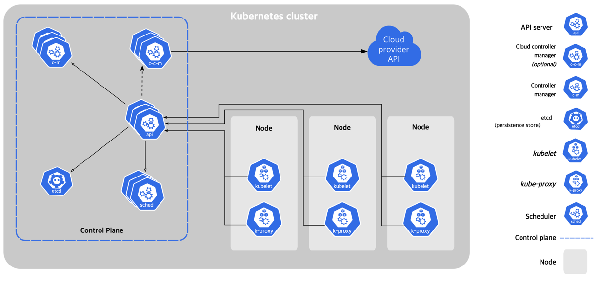

## Kubernetes Components

- Core Components
- Addons
- Flexibility in Architecture

---

## Core Components

- Clubernetes cluster = control plane + 1개 이상의 worker nodes

### Control Plane Components

- cluster의 전체 상태를 관리
- **kube-apiserver** : k8s HTTP API를 노출
- **etcd** : API server 데이터를 저장하는 key-value store
- **kube-scheduler** : 적절한 노드에 pod를 할당
- **kube-controller-manager** : k8s API를 구현한 controller 실행
- **cloud-controller-manager** (optional) : 하위 cloude provider와 통합

### Node Components

- 노드에서 실행중인 pod를 관리하고, k8s runtime 환경 제공
- 필요에 따라 노드에 추가 소프트웨어 설치 가능
    - e.g. Linux 노드의 systemd
- **kubelet** : pod가 컨테이너를 포함해 실행되도록 관리
- **kube-proxy** (optional) : 노드의 네트워크 룰을 설정
- **Container Runtime** : 컨테이너 실행을 담당하는 소프트웨어

## Addons

- k8s의 기능을 확장
- **DNS** : 클러스터 DNS resolution
- **Web UI (Dashboard)** : 클러스터 상태 확인 web interface
- **Container Resource Monitoring** : Container metric 수집, 저장
- **Cluster-level Logging** conainter log를 중앙 log 저장소에 저장

## Flexibility in Architecture

- k8s는 컴포넌트들이 배포/관리되는 방법을 유연하게 제공
    - 작은 규모에서 큰 규모 (프로덕션) 클러스터까지
