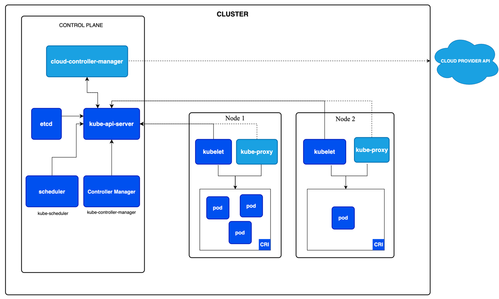

# Cluster Architecture

- Control plane components
- Node components
- Addons
- Architecture variations

- k8s cluster = control plane + n개의 worker machine (nodes)
    - clsuter는 pod를 구동하기 위해 반드시 1개 이상의 worker node가 필요
- worker node는 pod를 호스팅
- control plane은 worker node와 cluster 내 pod를 관리
- Production 환경에서 control plane은 여러 computer, cluster에 걸쳐 구동되어 fault-tolerant, high-availability를 제공

### contents

- [Nodes](Nodes.md)
- Communication between Nodes and the Control Plane
- Controllers
- Leases
- Cloud Controller Manager
- About cgroup v2
- Container Runtime Interface (CRI)
- Garbage Collection
- Mixed Version Proxy

---

## Control plane components

- scheduling과 같은 글로벌한 정책을 결정
- clsuter 이벤트를 탐지, 대응 e.g. Deployment `replica` 수를 만족하기 위한 pod 생성
- cluster 안의 어떤 머신이건 구동 가능하지만, setUp script는 동일 머신의 control plane component만 구동

### kube-apiserver

k8s API를 노출하는 서버, k8s control plane의 front-end  
kube-apiserver는 수평 확장 가능하도록 설계되어 있음

### etcd

k8s backing store를 위해 사용하는 key-value store  
cluster의 모든 데이터를 저장

### kube-scheduler

생성된 Pod를 node에 할당시킴   
스케쥴링 전략에는 resource requirements, hw/sw, policy 제약, 데드라인 등을 고려

### kube-controller-manager

controller process를 구동하는 컴포넌트  
각 Controller는 독립된 process 지만, 복잡성을 줄이기 위해 하나의 binary로 컴파일되어 단일 프로세스로 실행됨

#### controller type

- node controller : node 가 죽으면 노티, 응답
- job controller : job object를 와치하고, job을 실행 가느한 pod를 생성해 job을 구동
- EndpointSlice controller : EndpointSlice object 생성, 관리하여 service와 pod를 연결
- Service Account controllers : 새로운 namespace를 위한 default service account 생성

### cloud-controller-manager

control plane에는 cloud-specific contol 로직이 임베디드 되어있음
cloud-controller-manager는 cluster를 cloud provider API에 연결 가능(1)하게하고, cloud platform에 의존하는 컴포넌트를 분리시킴(2)  
cloud 환경에서 k8s를 실행할 때만 존재 (on-promise 환경에서는 필요 없고 없음)  
수평 확장 가능

#### cloud-controller-manager components

- Node controller : cloud provider를 체크 (node가 응답이 없을 시 cloud에 삭제되었는지 확인)
- Route controller : cloud infrastructure에 route 설정
- Service controller : cloud provider load balancer 생성, 수정, 삭제

## Node components

실행 중인 pod를 유지하고, k8s runtime 환경을 제공

### kubelet

각 노드 안에서 구동되는 에이전트. pod 내 컨테이너가 실행되도록 관리 (k8s에 의해 생성되지 않은 컨테이너는 관리하지 않음)  
PodSpec들을 가지고 있음

### kube-proxy (optional)

각 노드 내에 있는 네트워크 프록시  
network rule 설정으로 파드가 네트워크 연결이 클러스터 내부/외부로 가능하게 함  
OS packet filtering layer를 사용가능하면 사용하고 아니면 트래픽을 스스로 포워딩함  
service에 대한 패킷 포워딩 네트워크 플러그인을 사용중이라면, 굳이 노드에 kube-proxy를 구동할 필요 없음

### Container runtime

k8s가 container를 구동할 수 있게해주는 근본 컴포넌트. k8s environment에서 컨테이너 실행, 라이프사이클을 관리  
continerd, CRI-O 등을 사용해 컨테이너 런타임 구현

## Addons

클러스터 피쳐를 구현하기 위한 k8s 리소스 (e.g. DaemonSet, Deployment, ...)  
`kube-system` namespace (cluster-level 피쳐임)

### DNS

모든 k8s cluster는 반드시 cluster DNS를 가져야함  
Cluster DNS는 DNS 서버로, k8s service를 위한 DNS 레코드를 제공  
k8s에 의해 생성된 continaer는 자동으로 DNS server를 포함하게 됨

### Web UI (Dashboard)

k8s cluster를 시각화하기위한 web 기반 UI.  
사용자가 cluster내의 애플리케이션을 관리, 모니터링

### Container Resource Monitoring

컨테이너에 대한 시계열 데이터를 중앙 DB에 저장하고 UI로 시각화

### Cluster-level Logging

컨테이너 로그들을 중앙 저장소에 저장하고 인터페이스로 조회

### Network Plugins

CNI(Container Network Interface)를 사용해 pod 네트워크를 설정하는 소프트웨어  
pod에 IP를 할당하고 다른 클러스터간에 통신하도록 함

## Architecture variations

k8s를 배포하고 관리하는 방식은 다양. k8s 클러스터를 설계하고 유지하는데에는 이러한 다양성을 고려해야함

### Control plane deployment options

- Traditional deployment : 모든 control plane component를 단일 머신 (or VM)에 구동
- Static Pods : control plane component를 kubelet이 구동하는 static pod로 구동
    - kubeadm 툴에서 사용하는 방식
- Self-hosted : control plane component를 k8s cluster 내의 pod로 구동
    - Deployment, StatefulSet 등으로 k8s cluster를 관리
- Managed Kubernetes services : cloud provider에게 control plane을 관리하도록 위임

### Workload placement considerations

workload 의 배치는 (control plane component 포함) cluster의 사이즈, 성능 등에 따라 다양함

- 작고 development 환경의 clsuter : control plane, user workloads 들을 같은 node에 배치
- 더 큰 production 환경의 cluster : control plane component를 별도의 node에 배치 (user workloads와 node를 분리)
- 중요한 add-on을 구동하는 organization이나 모니터링 툴은 control plane 노드에 배치

### Cluster management tools

kubeadm, kops, Kubespray는 다양한 방식으로 클러스터를 배포하고 관리함. 각자 자기만의 관리, 컴포넌트 레이아웃이 있음

### Customization and extensibility

- Custom scheduler : 기본 k8s 스케쥴러와 같이 작동하거나 완전히 대체 가능
- Api server는 CustomResourceDefinition(CRD)을 사용해 API를 확장 가능
- Cloud provider는 cloud-controller-manager를 사용해 통합 가능
