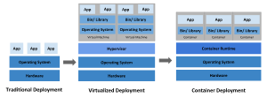

## Overview

- Why you need Kubernetes and what it can do
- What Kubernetes is not
- Historical context for Kubernetes

- k8s는 portable, extensible, opensource 플랫폼
- 컨테이너화된 worloads와 서비스를 declarative configuration과 automation을 통해 관리

### contents

- [Kubernetes Components](KubernetesComponents.md)
- [Objects In Kubernetes](ObjectsInKubernetes.md)
- The Kubernetes API

---

## Why you need Kubernetes and what it can do

- 컨테이너는 애플리케이션을 효율적으로 빌드해서 배포할 수 있게 함
- production 환경에서는 여러 컨테이너가 다운타임 없이 실행되어야 함
    - e.g. 컨테이너가 다운되면 다른 컨테이너가 대신 실행되어야 함
- k8s framework는 분산 시스템을 탄력적으로 운영하게 해줌
    - scaling, failover, deployment patterns, ...
    - e.g. 카나리 배포를 지원

### k8s의 주요 기능

- 서비스 discovery와 로드밸런싱
    - DNS와 IP를 이용해 컨테이너에 접근
    - 컨테이너의 트래픽이 높아지면 자동으로 로드밸런싱
- storage orchestration
    - local storage, public cloud storage 등을 자동으로 마운트
- 자동화된 롤아웃과 롤백 : 컨테이너의 상태를 정의하고 원하는 상태로 제어된 속도로 변경
    - e.g. 배포를 위한 컨테이너 생성 -> 기존 컨테이너 제거
- 자동화된 bin packing : 지정한 리소스를 최대한 활용하도록 컨테이너 배치
    - 컨테이너가 사용할 CPU, RAM 등을 지정
- self-healing : 컨테이너가 다운되면 자동으로 다시 실행
    - 컨테이너가 실패하면 자동으로 대체
    - 사용자가 지정한 health check를 통해 컨테이너 상태 확인 후 kill
- secret and configuration management : 암호화된 데이터와 설정을 컨테이너에 안전하게 전달
    - e,g, OAuth 토큰, DB 비밀번호, SSL 인증서 등
    - 암호화된 데이터를 이미지 리빌드 없이 컨테이너에 전달
- Batch execution : 배치 작업을 실행하고 완료되면 종료
    - batch, CI 작업을 관리, 실패시 컨테이너 교체 가능
- Horizontal scaling : 컨테이너를 수평으로 확장
    - 간단한 커맨드로 scale up/down 가능
- IPv4/IPv6 dual-stack : IPv4/IPv6를 동시에 지원
    - 파드에 IPv4/IPv6 주소를 할당 가능
- 확장성 : k8s cluster에 upstream source code 수정 없이 확장 가능

## What Kubernetes is not

| PaaS                                                  | k8s                     |
|-------------------------------------------------------|-------------------------|
| 하드웨어 레벨에서 operation                                   | 컨테이너 레벨에서 operation     |
| 배포, scaling, load balancing, logging, monitoring, ... | PaaS 기능을 pluggable하게 제공 |

### k8s의 차이점

- 애플리케이션 타입에 제한이 없음
    - 컨테이너에서 동작하는 애플리케이션은 k8s에서 관리 가능
    - 무(유)상태, data-processing 작업 등 다양한 workloads 지원
- source code를 배포하지 않음, 애플리케이션을 빌드하지 않음
    - CI/CD는 별도로 정의 (조직의 CI/CD pipeline에 맞게)
- application-level의 서비스 제공하지 않음
    - e.g. 미들웨어 (메시지 버스), data-processing framework (Spark, Flink), database (MySQL, Postgres) 등
    - k8s에서 실행은 가능 Open Service Broker를 오해 가능
- 로깅, 모니터링, alert solutio 미강제
- 자체 언어/시스템 제공하지 않음. delcarative API를 통해 제어
- 단순한 오케스트레이션 시스템이 아님
    - 전통적인 오케스트레이션 : workflow에 맞게 실행 e.g. A실행 후 B실행 후 C실행
    - k8s : 독립적이고, 조합 가능한 제어 프로세스 세트의 조합

## Historical context for Kubernetes

### Traditional deployment era

- 물리 서버위에서 애플리케이션 실행
- 물리서버 내에서 애플리케이션의 리소스 분리 방법 없음 -> 리소스 할당 이슈 발생
    - 특정 애플리케이션이 리소스를 많이 사용하면 다른 애플리케이션에 영향을 줌
    - 해결방법 : 다른 물리 서버에 애플리케이션을 실행

### Virtualized deployment era

- 가상화 : 여러개의 VM을 하나의 물리 서버에서 실행
- 가상화를 통해 VM간에 리소스 분리(격리) 가능
- VM은 가상화된 하드웨어 위에서 자체 OS를 가지고 실행

### Container deployment era

- 컨테이너는 VM과 유사
- 컨테이너는 애플리케이션간에 OS를 공유하기 위해 느슨하게 격리
    - 컨테이너는 자체 OS가 없으므로 가볍고 빠름
- infra로부터 디커플링되어있어, 클라우드, OS 다양한 곳에 이식 가능

#### 장점

- 애자일한 애플리케이션 생성, 배포
    - VM 이미지보다 빠르게 생성, 배포 가능
- CI/CD : 빠르게 자주 컨테이너 이미지를 빌드하고 배포 가능, 롤백 가능 (이미지 immutability)
- Dev와 Ops의 분리
    - 애플리케이션을 infra로부터 디커플링하여, Dev와 Ops의 역할을 분리
- Observability : 애플리케이션 레벨의 health, signal 체크 가능
- 환경 일관성 : 개발, 테스트, production 환경이 동일
- 다양한 OS, 클라우드 환경에서 실행 가능
- 애플리케이션 중심 관리 : OS 레벨에서의 추상화 수준을 높임, OS의 가상 리소스 사용
- 낮은 결합, 분산, 탄력적, 마이크로서비스
    - 애플리케이션을 잘게 쪼갬
    - 작은 애플레킹션을 동적으로 관리, 배포 가능
- 리소스 격리 : 예측 가능한 애플리케이션 성능
- 리소스 효율
